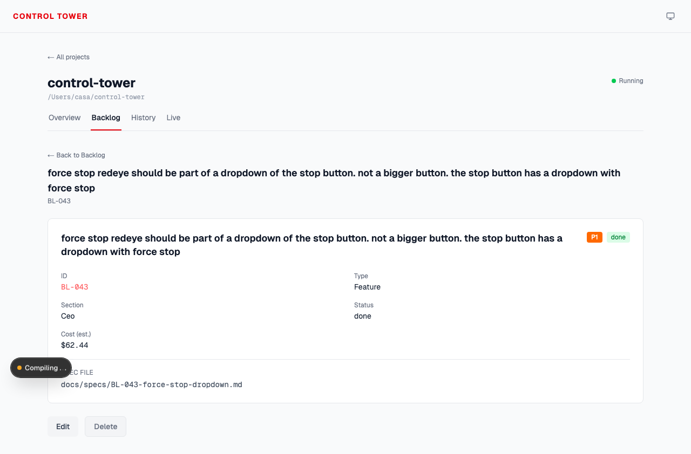

<div align="center">
  <h1>Control Tower</h1>
  <p><strong>A web dashboard to orchestrate <a href="https://github.com/Bitmia-ai/RedEye">RedEye</a> across multiple projects.</strong></p>

  <p>
    <a href="https://github.com/Bitmia-ai/ControlTower/blob/main/LICENSE">
      
    </a>
    
    
  </p>

  
</div>

---

## What is Control Tower?

Control Tower is the management console for [RedEye](https://github.com/Bitmia-ai/RedEye). It lets you start and stop autonomous dev sessions across multiple projects, answer inbox questions without leaving the browser, steer mid-flight, read the live Claude transcript, and track cost per task — all from a single dashboard.

You run it locally. It binds to `127.0.0.1`, reads your own `~/.claude/projects/` transcripts, and writes to your projects' `.redeye/` control files. No cloud, no auth, no telemetry, no hosted backend.

## Screenshots

<table>
  <tr>
    <td align="center"><strong>Mission Control</strong><br/>per-project phase, health, questions, up-next, cost</td>
    <td align="center"><strong>Backlog detail</strong><br/>sub-tasks, spec, cost, and outcome</td>
  </tr>
  <tr>
    <td></td>
    <td></td>
  </tr>
</table>

## Quick Start

### Prerequisites

- Node 20 or newer
- [Claude Code](https://docs.anthropic.com/en/docs/claude-code) with the [RedEye](https://github.com/Bitmia-ai/RedEye) plugin installed

### Install

```bash
git clone https://github.com/Bitmia-ai/ControlTower.git
cd ControlTower
npm install
npm run dev
```

Open [http://localhost:3200](http://localhost:3200).

### First project

Click **+ Add project** on the home page, point it at a git repo that has already run `/redeye:init` (or a fresh repo — Control Tower will walk you through init). The project shows up as a card and you can start/stop RedEye from there.

Projects live in `~/.redeye/config.json`. Override the location with `REDEYE_CONFIG_PATH=/custom/path` if you want.

### Change the port

Default is `3200`. To use a different port:

```bash
npx next dev --port 4000
```

## How It Works

Control Tower is a thin stateless UI over your local `.redeye/` files.

- **Project list** — reads `~/.redeye/config.json` (user-editable, dynamic, no hardcoding).
- **Per-project state** — reads `.redeye/state.json`, `backlog.md`, `inbox.md`, `status.md`, `changelog.md`, `feedback.md` on each poll. The dashboard never writes these files except through explicit user actions (backlog add, steer, answer).
- **Session lifecycle** — `session-manager.ts` spawns and tracks a Claude Code process per project. Stop detection, auto-restart on crash, stall detection (no transcript activity for 10 min), and SIGTERM→SIGKILL cleanup on stop.
- **Live tab** — tails the most recent Claude transcript file under `~/.claude/projects/<project-slug>/`, parses the JSONL stream, renders tool calls, thoughts, and inter-round messages as a readable timeline.
- **Cost tracking** — aggregates `cost_usd` from transcript events, per-session and per-task (snapshot recorded when a backlog item merges).

All process spawning uses `spawn()` with argument arrays. No shell-string interpolation anywhere.

## Actions

From the dashboard you can:

| Action | What it does |
|--------|--------------|
| Start | Spawns a RedEye CTO session for a project |
| Stop | SIGTERM the CTO process, falls back to SIGKILL after 10s |
| Force stop | Immediate SIGKILL (for unresponsive sessions) |
| Pause | Writes `PAUSE` to `.redeye/steering.md` — RedEye pauses after the current feature cycle |
| Add backlog | Type your vague one-liner, RedEye's plugin expands it into a full entry |
| Steer | Adds a directive to `.redeye/steering.md` picked up at the start of every iteration |
| Answer | Writes your answer to `.redeye/inbox.md` — RedEye incorporates it next iteration |
| Live | Tails the Claude transcript in real time |

## Safety

Control Tower is **local-only by design**:

- Binds to `127.0.0.1` only. Do not expose to a public network.
- No authentication. If a process on your machine can reach port 3200, it can control your sessions.
- Reads `~/.claude/projects/*.jsonl` on your machine. Those files contain your prompts, outputs, and costs — Control Tower does not transmit them anywhere.
- Spawns Claude Code processes as your user with `--dangerously-skip-permissions` (same as any RedEye CLI invocation). Make sure you trust the projects you add.

If you want to run Control Tower on a remote server and view it from your laptop, use SSH port-forwarding:

```bash
ssh -L 3200:127.0.0.1:3200 user@your-server
```

## FAQ

**Does it replace the RedEye CLI commands?**
No — it's a complementary UI. Everything works via the same `.redeye/*.md` files the CLI uses. You can use both interchangeably.

**Can I run Control Tower for a team?**
Not as shipped. It's single-user, no auth, local-first. A future version could add that, but it's not the current direction.

**What if I close my laptop?**
Sessions stop. When you restart Control Tower and click Start on a project, RedEye's crash recovery resumes from the last checkpoint. See the RedEye docs.

**Does it phone home?**
No. No analytics, no telemetry, no crash reporting. Control Tower talks to Anthropic's API only through the Claude Code processes it spawns (which do what they normally do).

**How does cost tracking work?**
It parses `cost_usd` fields from the Claude transcript JSONL files in `~/.claude/projects/`. Per-session cost is the sum within the current process's transcript; total cost is the sum across all transcripts for a project. Per-task cost is snapshotted when a backlog item transitions to `done`.

**Can I use it without RedEye?**
No — Control Tower is specifically a RedEye management layer. For generic Claude Code orchestration, use something else.

## Architecture

```
app/                     # Next.js App Router routes + API handlers
├── page.tsx             # Home (project list + cards)
├── project/[id]/        # Per-project mission control, backlog, history, live tabs
└── api/projects/...     # REST endpoints — reads/writes .redeye/*.md, manages sessions

lib/
├── projects.ts               # Project registry (~/.redeye/config.json)
├── redeye-files.ts           # Parsers for backlog.md, state.json, inbox.md, etc.
├── redeye-parsers.ts         # Changelog parser, inbox parser, deduplication
├── session-manager.ts        # Spawns/tracks CTO processes, stall detection, auto-restart
├── transcript-file-resolver.ts  # Maps project path → most recent JSONL
└── cost.ts                   # Aggregates cost from transcripts

components/
├── mission-control/     # Per-project cards (Working On, Health, Cost, etc.)
├── add-backlog-dialog.tsx, steer-dialog.tsx, answer-modal.tsx
└── ...
```

## Contributing

See [CONTRIBUTING.md](CONTRIBUTING.md). Please open an issue first for anything larger than a typo. Security issues: see [SECURITY.md](SECURITY.md).

> [!NOTE]
> Control Tower is a personal project maintained in spare time. It works, but updates are infrequent. Feedback and contributions welcome.

## License

[MIT](LICENSE) — Copyright (c) 2026 Bitmia-ai
