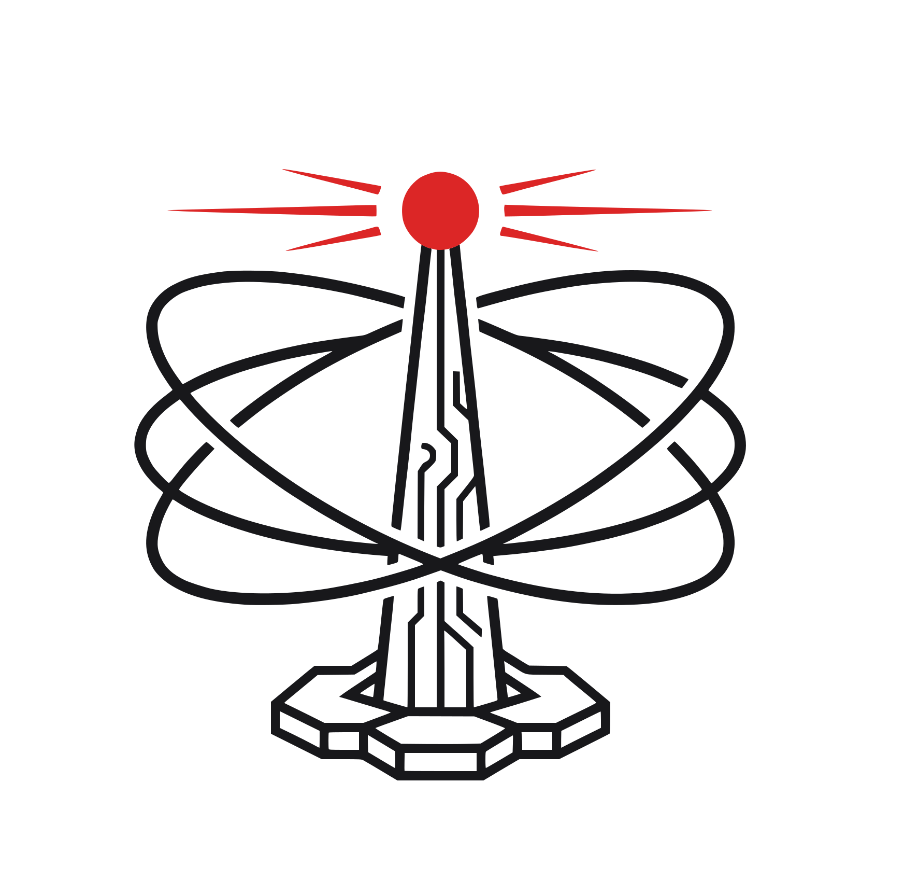
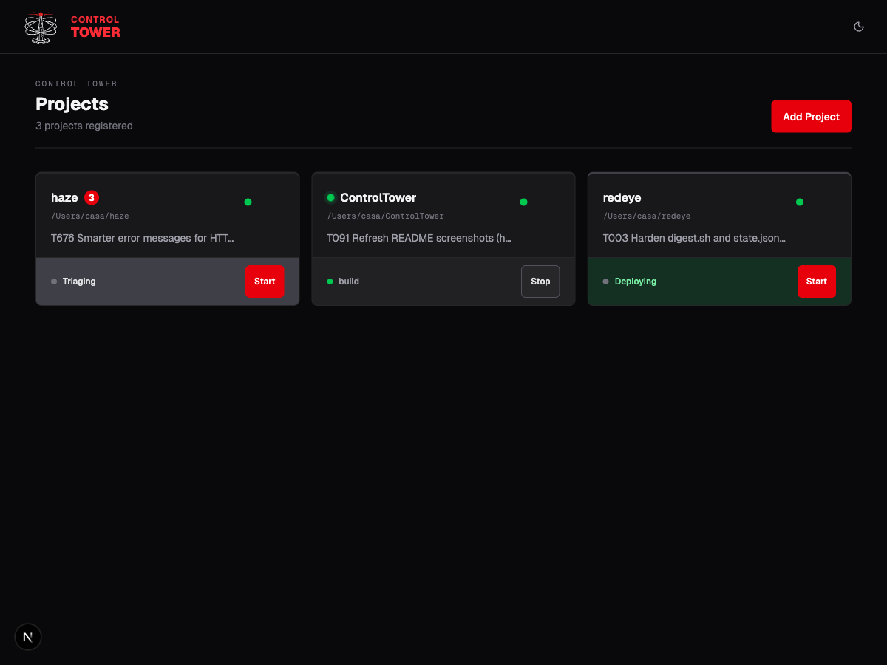
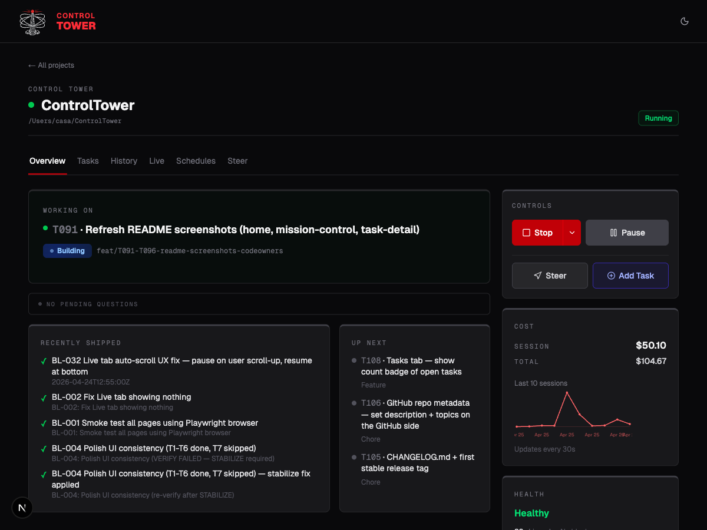
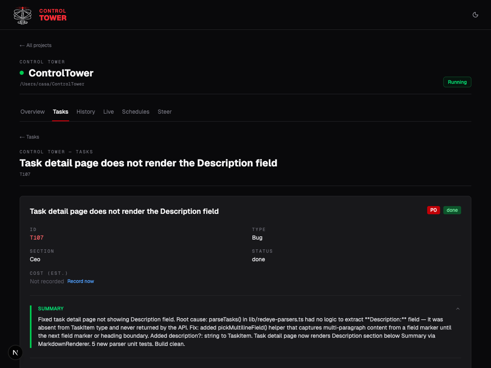

<div align="center">
  
  <h1>Control Tower</h1>
  <p><strong>Watch RedEye work — across all your projects, from a browser.</strong></p>

  <p>
    <a href="https://github.com/Bitmia-ai/ControlTower/blob/main/LICENSE">
      
    </a>
    
  </p>

  
</div>

---

## What is Control Tower?

Start [RedEye](https://github.com/Bitmia-ai/RedEye) sessions, answer questions in the inbox, steer mid-flight, watch the Claude transcript live, and track cost per task — all from one local web dashboard. One project or twenty, same screen.

You stay in control. The dashboard is single-user, local-only, and writes to your projects' `.redeye/` files only when you click something. No cloud, no auth, no telemetry.

> [!NOTE]
> Control Tower is a personal project maintained in spare time. It works, but updates are infrequent. Feedback and contributions welcome.

## Screenshots

> **Note for maintainers:** screenshots in `.github/assets/` were captured against a local install and need to be regenerated before public release.

<table>
  <tr>
    <td align="center"><strong>Mission Control</strong><br/>per-project phase, health, questions, up-next, cost</td>
    <td align="center"><strong>Task detail</strong><br/>sub-tasks, spec, cost, and outcome</td>
  </tr>
  <tr>
    <td></td>
    <td></td>
  </tr>
</table>

## Quick Start

### Prerequisites

- Node 20 or newer
- [Claude Code](https://docs.anthropic.com/en/docs/claude-code) with the [RedEye](https://github.com/Bitmia-ai/RedEye) plugin installed

### Install and run

```bash
git clone https://github.com/Bitmia-ai/ControlTower.git
cd ControlTower
npm install
npm run build && npm start
```

Open [http://localhost:3200](http://localhost:3200).

> Always run as production. `npm run dev` is for working on Control Tower itself — see [Contributing](#contributing).

### Change the port

The `npm start` script hardcodes `--port 3200`, so `PORT=4000 npm start` has no effect. Use the `next start` form directly:

```bash
npx next start --hostname 127.0.0.1 --port 4000
```

## How It Works

1. **Add a project** — point it at a git repo (Control Tower walks you through `redeye:init` if needed)
2. **Click Start** — RedEye picks up the top task and works its triage → plan → build → review → deploy → verify → merge cycle
3. **Answer questions** — when RedEye logs an inbox question, the bell badges. Click, answer, RedEye picks it up next iteration.
4. **Steer or add tasks** — type a one-liner; RedEye expands it into a full backlog entry
5. **Read the live tab** — tools, thoughts, and inter-round messages stream in real time
6. **See what shipped** — History tab shows each session's task, phase flow, and cost

The dashboard never writes to `.redeye/*` on its own — only when you click something. Everything stays in plain markdown files; you can mix and match with the RedEye CLI.

## Remote access

Control Tower binds to `127.0.0.1` and has no auth. To reach it from another device, tunnel into the box.

### SSH port-forward

```bash
ssh -L 3200:127.0.0.1:3200 user@your-server
```

Open [http://localhost:3200](http://localhost:3200) on the laptop.

### Tailscale serve

Make Control Tower reachable on your tailnet at `https://<machine>.<tailnet>.ts.net`:

```bash
npm run build && npm start            # in one shell
tailscale serve --bg --https=443 3200 # in another
```

> **Tailscale requires production mode.** Dev mode does not work behind reverse proxies — see [tailscale/tailscale#18827](https://github.com/tailscale/tailscale/issues/18827). If the home page hangs on "Loading projects…", you are on dev mode; switch to `npm run build && npm start`.

Traffic only crosses your tailnet — no public exposure, no external auth surface.

## Safety

- **Local-only.** Binds to `127.0.0.1`. Tunnel in via [Remote access](#remote-access) instead of exposing the port.
- **No authentication.** Anything on your machine that reaches port 3200 can control your sessions.
- **Trust your projects.** Control Tower spawns Claude Code as your user with `--dangerously-skip-permissions` (same as the RedEye CLI). Don't add projects you don't trust.

## How It's Different

The RedEye CLI works the same files Control Tower works. So why use this?

- **Multiple projects, one screen.** Watch all your sessions at once instead of `tail -f` across terminals.
- **Live transcript.** Read what the agent is doing without attaching to a Claude Code session.
- **Cost per task.** Snapshotted on `done`, aggregated per project, forecasted from velocity.
- **Mobile-friendly PWA.** Install on your phone, answer inbox questions from the couch.

If you only ever run one project from one terminal, the CLI is fine. Control Tower starts to pay off the moment you have two.

## Limitations

- **Single-user, no auth.** No accounts, no roles, no shared installs. One person, one machine.
- **macOS / Linux only.** Tested there; Windows is unsupported.
- **No remote pushes.** Inherits RedEye's policy — commits land locally, you push.
- **Always run as production.** `npm run dev` exists, but reverse proxies (Tailscale, ngrok), service-worker caching, and self-dogfood deploys all expect the prod server.
- **State lives in files, not a database.** A corrupted `.redeye/state.json` will surface as a broken card; fix the file.

## FAQ

**Does it replace the RedEye CLI?**
No — same files, complementary UI. Mix and match.

**Can I run it for a team?**
Not as shipped. Single-user, no auth.

**What if I close my laptop?**
Sessions stop. On restart, click Start; RedEye's crash recovery picks up from the last checkpoint.

**Does it phone home?**
No telemetry, no analytics. Talks to Anthropic only through the Claude Code processes it spawns.

**How does cost tracking work?**
Parses `cost_usd` from `~/.claude/projects/*.jsonl`. Per-session = sum within the active transcript. Per-task = snapshot at `done`. Total = sum across all transcripts for the project.

**Can I use it without RedEye?**
No. For generic Claude Code orchestration, use something else.

**Why does dev run on webpack instead of Turbopack?**
Turbopack has no documented directory-exclude API and walks the entire project root, which makes RedEye's `.worktrees/T-N/` clones balloon the in-memory module graph past 80 GB. Webpack honors `watchOptions.ignored` in `next.config.ts` to mask them out. Production `next build` still uses Turbopack.

## Troubleshooting

**Port 3200 already in use** — `lsof -ti:3200 | xargs kill -9`, or run on another port: `npx next start --hostname 127.0.0.1 --port 4000`.

**`npm run build` fails with module-not-found** — `npm install` then retry.

**Home page hangs on "Loading projects…"** — you are on `npm run dev` behind a reverse proxy. Switch to `npm run build && npm start`. If you are already on prod, check the network tab — a 403 on `GET /api/projects` means the CSRF middleware rejected an `Origin` header mismatch.

**Project page shows "Something went wrong"** — stale `.next/` chunks served during a self-dogfood DEPLOY. Run `npm run build && npm start` to recover.

**RedEye loop won't start** — verify `which claude` works and `~/redeye/plugin.json` exists. Re-install RedEye with `--plugin-dir ~/redeye` if not.

## Roadmap

- **Control Tower Cloud** — coordination-only SaaS so you can watch sessions, answer questions, and steer from anywhere without exposing your machine. BYOK Claude.
- **Telegram integration** — answer inbox questions and steer from your phone without a browser.

## Architecture

See [ARCHITECTURE.md](ARCHITECTURE.md) for code map, request flows, invariants, and a "where to look for what" cheat sheet.

## Contributing

See [CONTRIBUTING.md](CONTRIBUTING.md). Open an issue first for anything larger than a typo. Security issues: see [SECURITY.md](SECURITY.md).

If you are working on Control Tower itself, use `npm run dev` for hot-reload, then verify against `npm run build && npm start` before opening a PR — the prod server is the one users actually run.

## License

[MIT](LICENSE) — Copyright (c) 2026 Bitmia-ai
